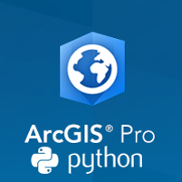

<!DOCTYPE html>
<html>
<head>
  <meta charset="utf-8">
  <link rel="shortcut icon" href="reveal.js/favicon.ico">
  <meta name="generator" content="pandoc">
  <meta name="author" content="Clinton Dow">
  <title>Professional Python Development in ArcGIS Pro</title>
  <meta name="apple-mobile-web-app-capable" content="yes">
  <meta name="apple-mobile-web-app-status-bar-style" content="black-translucent">
  <meta name="viewport" content="width=device-width, initial-scale=1.0, maximum-scale=1.0, user-scalable=no, minimal-ui">
  <link rel="stylesheet" href="reveal.js/css/reveal.css">
  
  <link rel="stylesheet" href="reveal.js/css/theme/esri-uc-2017.css" id="theme">
  <link rel="stylesheet" href="src/uc-custom.css"/>

  <!-- Code syntax highlighting -->
  <link rel="stylesheet" href="reveal.js/lib/css/solarized_dark.css">

  <!-- Printing and PDF exports -->
  
  <!--[if lt IE 9]>
  
  <![endif]-->
</head>
<body>
  

    

<section data-background="images/title.png" class="title">
  <h1 class="title">Professional Python Development in ArcGIS Pro</h1>
  <h2 class="author">Clinton Dow</h2>
</section>

<section class="slide level2">

<section data-background="images/title.png">
<h2>
<a href="https://github%20.com/scw/conda-uc-2017-demo">https://github.com/scw/conda-uc-2017-demo</a>
</h2>
<h3>
<a href="https://4326%20.us/esri/conda-uc/uc-2017-conda-arcgis-demo-full.pdf">High Quality PDF (2MB)</a>
</h3>
</section>
</section>
<section><section id="introduction" class="titleslide slide level1" data-background="images/Picture2.jpg"><h1>Introduction</h1></section><section id="intro" class="slide level2">
<h2>Intro</h2>

About me: - Product Engineer - Geoprocessing at Esri (1 year 8 months) - Python - ArcPy - Conda Integration - C#/WPF - Python Backstage - Charts and Graphs - Presentations - Previously a GIS Developer at Matrix Solutions in Calgary - Civil Engineering/Environmental Consultant Firm - Created several dozen custom Geoprocessing tools in Python - Customized ArcGIS with Python and C#/WPF

</section></section>
<section><section id="esri-arcgis" class="titleslide slide level1"><h1>Esri ArcGIS</h1></section><section id="setting-up-arcgis-pro" class="slide level2">
<h2>Setting up ArcGIS Pro</h2>
<ul>
<li><strong>Windows Only</strong></li>
<li>Free Windows VMs</li>
<li>(http://bit.ly/FreeWindowsVM)</li>
<li>Free ArcGIS Pro</li>
<li>(http://bit.ly/ArcPyProTrial)</li>
<li>ArcPy Documentation</li>
<li>http://bit.ly/ArcPyDocs</li>
</ul>
</section><section id="why-arcgis" class="slide level2" data-background="images/Picture2.jpg">
<h2>Why ArcGIS? </h2>
<ul>
<li>Powerful and Proven technology
<ul>
<li>ARC/INFO released in 1982</li>
<li>ArcGIS in 1999</li>
<li>ArcGIS Pro in 2015</li>
</ul></li>
<li>Extensive Python Support:</li>
<li><a href="http://pro.arcgis.com/en/pro-app/arcpy/get-started/what-is-arcpy-.htm">ArcPy</a></li>
<li><a href="https://developers.arcgis.com/python/">ArcGIS Python API</a></li>
<li>Second-to-None Documentation</li>
<li>Esri Blog</li>
<li>Esri Press</li>
<li>ArcGIS Help</li>
<li>Supports multiple GIS Applications</li>
<li>ArcGIS Desktop</li>
<li>ArcGIS Enterprise</li>
<li>ArcGIS Online</li>
<li>Rich source of GIS Data</li>
<li>ArcGIS Online provides thousands of ready-to-go datasets.</li>
<li>Large selection of Plugins</li>
<li>https://marketplace.arcgis.com/</li>
<li>Included suite of cartographic symbology.</li>
<li>Industry Standard solution - Used by Governments, Fortune 500 companies and Individuals.
<ul>
<li>Swiss Gov’t examples (Canton Governments, Swiss Institute of Forest, Snow and Landscape Research etc)</li>
</ul></li>
</ul>
</section><section id="why-arcgis-pro" class="slide level2" data-background="images/Picture2.jpg">
<h2>Why ArcGIS Pro?</h2>

Modern View for ArcGIS:

<ul>
<li>.Net 4.5 concurrency model</li>
<li>Integrated 2D and 3D views</li>
<li>In active development, New Features</li>
<li>Modern Python Experience</li>
<li>Supports environments and packages via Conda</li>
</ul>
<figure>

</figure>
</section></section>
<section><section id="python-packages-and-environments" class="titleslide slide level1"><h1>Python Packages and Environments</h1></section><section id="package-management-on-windows" class="slide level2" data-background="images/Picture2.jpg">
<h2>Package Management on Windows</h2>

Using <code>pip</code>, wheels, virtualenvs - Packaged with distributions of Python - These tools handle the harder problem of system dependencies, considered out of scope by Python packagers — does it end up in <code>site-packages</code>? - Package devs: On OSX and Linux, ‘easy’ to get the deps! Use a system package manager (e.g. <code>apt</code>, <code>brew</code>, <code>yum</code>) and the included compiler (e.g. <code>clang</code>, <code>gcc</code>).

</section><section id="virtual-environments" class="slide level2">
<h2>Virtual Environments</h2>

What are Virtual Environments - Self-contained instances of Python - Seperate from main Python installation - Can contain a unique set of packages - Useful when working on multiple projects at one time

</section><section id="what-about-windows" class="slide level2" data-background="images/Picture2.jpg">
<h2>What about Windows?</h2>
<ul>
<li>We are particularly stuck on Windows which lacks broadly used package management</li>
<li>Only developers have a C compiler on their machine (Typically Visual Studio)</li>
<li>A hard problem for many organizations to reliably solve</li>
<li>“Works on my machine but not yours” problem.</li>
<li>Supporting users takes up valuable dev time</li>
<li>No guarantee that customers will be supported</li>
</ul>
</section></section>
<section><section id="enter-conda" class="titleslide slide level1"><h1>Enter Conda</h1></section><section id="why-conda" class="slide level2" data-background="images/Picture2.jpg">
<h2>Why Conda?</h2>
<ul>
<li>Scientific Python community identified that there was a gap not being addressed by the core Python infrastructure, limiting their ability to get packages into the hands of users</li>
<li>Industry standard built by people who care about this space — Continuum Analytics</li>
<li>Handles dependencies for many languages (C, C++, R and of course Python)</li>
<li>Built for Python first, but it really solves a much broader infrastructural issue.</li>
</ul>
</section><section id="conda-in-arcgis-pro" class="slide level2">
<h2>Conda in ArcGIS Pro</h2>

Significant effort has been made at Esri to integrate the conda package manager and virtual environment experience into the ArcGIS Pro experience. - Shipped with environment support - In-app user interface - Packaging effort for Esri Python code

</section></section>
<section><section id="using-packages-to-our-advantage" class="titleslide slide level1" data-background="images/Picture5.jpg"><h1>Using Packages to our Advantage</h1></section><section id="open-source-ecosystem" class="slide level2" data-background="images/Picture5.jpg">
<h2>Open Source Ecosystem </h2>
<ul>
<li>The Python Ecosystem includes thousands of open-source packages</li>
<li>Esri is using several packages</li>
<li>NumPy</li>
<li>SciPy</li>
<li>matplotlib</li>
<li>Pandas</li>
<li>Automate or Extend your ArcGIS capabilities</li>
<li>Easily package and share your work</li>
</ul>
</section><section id="setting-up-a-development-environment" class="slide level2">
<h2>Setting up a Development Environment</h2>
<ul>
<li>What can we install? Not just scientific packages.</li>
<li>Documentation</li>
<li>Datasets</li>
<li>GUI toolkits (PyQt, TKinter)</li>
<li>Database Drivers (psycopg2)</li>
<li>C++ Libraries (Boost)</li>
<li>IDEs (Spyder, Juptyer)</li>
</ul>
</section></section>
<section><section id="working-with-customers" class="titleslide slide level1"><h1>Working with Customers</h1></section><section id="requirements-analysis" class="slide level2">
<h2>Requirements Analysis</h2>

Determining user expectations for a new or modified product - Identify Stakeholders - Eliciting Requirements - Stakeholder interviews - Ethnography - Analyzing Requirements - Clear - Complete - Consistent - Recording Requirements - User Stories - Use Cases

</section><section id="test-driven-development" class="slide level2">
<h2>Test Driven Development</h2>

Turning valid requirements into testable code - Identifying units of work - Defining functional extent of units - Writing tests to encapsulate functionality

</section><section id="efficient-testing-with-arcpy" class="slide level2">
<h2>Efficient Testing with ArcPy</h2>

Extra considerations for Geospatial tools - Data set types - Projections - UI interactions

</section></section>
<section><section id="version-control-as-a-communication-tool" class="titleslide slide level1"><h1>Version Control as a Communication Tool</h1></section><section id="what-is-git" class="slide level2">
<h2>What is Git?</h2>

A distributed version control system. - Originally made for linux developers - Arguably the most popular open-source version control - Heavily used in Conda packaging workflow

</section><section id="why-git" class="slide level2">
<h2>Why Git?</h2>

Features of Git that support Conda packaging - Commit hash as version number - Natively supports cross-language projects - Packages can ‘cherry-pick’ parts of repos - Also can aggregate multiple repos

</section><section id="what-is-github" class="slide level2">
<h2>What is Github</h2>

Github promotes ‘Social Coding’ a combination of Version Control and Social Media - Ease of Collaboration - Ease of Communication - Ease of Distribution Esri on Github - https://www.github.com/Esri - https://www.github.com/arcpy

</section><section id="github-as-a-communication-tool" class="slide level2">
<h2>Github as a Communication Tool</h2>

Github offers several features which enhance communication - Issue tracking - Tags - User Notifications - Repository Forking

</section></section>
<section><section id="creating-tools-in-arcgis-pro" class="titleslide slide level1"><h1>Creating Tools in ArcGIS Pro</h1></section><section id="tbx-toolboxes" class="slide level2">
<h2>TBX Toolboxes</h2>

The original ArcGIS toolbox. - Created via the ArcGIS GUI - Tool Validation not set in Python script - Set via ‘Properties’ menu of tool in ArcGIS - Out of scope for this Presentation

</section><section id="python-toolboxes" class="slide level2">
<h2>Python Toolboxes</h2>

ArcGIS toolboxes revisited in Python - All steps defined in a .pyt file - Validation defined within script - Works with Python IDEs - Define .pyt as a Python filetype in settings - Toolbox Class - <strong>init</strong> - self.tools - Tool Class - <strong>init</strong> - Validation - Logic

</section><section id="tool-validation" class="slide level2">
<h2>Tool Validation</h2>

ArcGIS Supports Dozens of Data Types - Ensure the inputs supplied by the user are valid - Dynamically populate fields with values - Inform users when unexpected or unusable data is present

</section><section id="inputoutput-parameters" class="slide level2">
<h2>Input/Output Parameters</h2>

Defining Parameters Working with Input Parameters - GetInputParameter - GetInputParameterAsText - Parameters from Command Line Working with Output Parameters - Schema - ParameterDependencies

</section><section id="getparameterinfo" class="slide level2">
<h2>getParameterInfo</h2>

Populate the values of a Tool’s Parameters - Called when the tool is opened. - Populate input parameters with inital values

</section><section id="updateparameters" class="slide level2">
<h2>updateParameters</h2>

Refine and Modify the values of a Tool’s Parameters - Called whenever a parameter has been changed in the ArcGIS GUI - Frequent calls - Make method ‘inexpensive’ if possible - May use ‘global’ values to store results after first call

</section><section id="updatemessages" class="slide level2">
<h2>updateMessages</h2>

Modify the Messages created when a Tool’s Parameters have changed - Called after validation has been performed. - Display a Warning or Error to users if Parameters have bad values

</section><section id="islicensed" class="slide level2">
<h2>isLicensed</h2>

Query the license system to ensure the tool can run at the current license level. - Checking for licenses

</section><section id="execute" class="slide level2">
<h2>execute</h2>

The tool’s source code which is run upon tool execution. -

</section><section id="tool-logic" class="slide level2">
<h2>Tool Logic</h2>

Where the Geoprocessing of data is accomplished - This is the only part of the code which should call Geoprocessing Tools - Returns either a dataset or a status code - SetSeverityLevel - SetOutputParameter

</section></section>
<section><section id="modular-design" class="titleslide slide level1"><h1>Modular Design</h1></section><section id="validation-modules" class="slide level2">
<h2>Validation modules</h2>

For each validation requirement: - Create a function which will validate a dataset - Create a dataset which satisfies the validation requirements - Create one or more datasets which do not satisfy requirements - Write validation functions

</section><section id="debuggingtesting-tool-validation" class="slide level2">
<h2>Debugging/Testing Tool Validation</h2>

Creating tests for validation: - Validation accomplishes two things - Ensuring the data set is ‘clean’ - Ensuring the data set will not crash the tool - Two types of tests - Correct data does not trigger any errors - Incorrect data is error handled and returns a message

</section><section id="planning-the-logic-of-a-tool" class="slide level2">
<h2>Planning the Logic of a Tool</h2>

For each requirement in a tool: - Create a function which accomplishes the requirement statement - Call the function from the applicable test method(s) - Commit when the code passes the test(s)

</section><section id="granularity-in-tool-design" class="slide level2">
<h2>Granularity in Tool Design</h2>

Can we break a tool into multiple tools? - Does any requirement make sense as a standalone tool? -

</section><section id="reusing-modular-code" class="slide level2">
<h2>Reusing Modular Code</h2>

Tool Metadata - Tags

</section></section>
<section><section id="conda-environments" class="titleslide slide level1"><h1>Conda Environments</h1></section><section id="development-environments" class="slide level2">
<h2>Development Environments</h2>
<ul>
<li>Contains features in development</li>
<li>May use alpha/beta code</li>
<li>Contain test modules &amp; data</li>
<li>Mirrored by version control</li>
<li>Contains packaging metadata</li>
<li>bld.bat/bld.sh</li>
<li>LICENSE</li>
<li>Manifest.in</li>
<li>meta.yaml</li>
<li>README.md</li>
<li>setup.py</li>
</ul>
</section><section id="production-environments" class="slide level2">
<h2>Production Environments</h2>
<ul>
<li>Stable environments in which to run tools/services</li>
<li>Requires stable versions of packages</li>
<li></li>
</ul>
</section></section>
<section><section id="packaging-tools-the-right-way" class="titleslide slide level1"><h1>Packaging Tools the Right Way</h1></section><section id="creating-a-package" class="slide level2">
<h2>Creating a Package</h2>

Using setuptools and distutils to create a Python Package. - setuptools - setup - pkg_resources - distutils - Legacy, use setuptools if possible Creating a conda package - conda-build - meta.yaml

</section><section id="documenting-a-package" class="slide level2">
<h2>Documenting a Package</h2>
</section><section id="deploying-a-package-internally" class="slide level2">
<h2>Deploying a Package Internally</h2>

On a network Via a http server

</section><section id="deploying-a-package-publicly" class="slide level2">
<h2>Deploying a Package Publicly</h2>

Python Package Index Anaconda.org Custom Server

</section></section>
<section><section id="viewing-the-tool-output" class="titleslide slide level1"><h1>Viewing the Tool Output</h1></section><section id="tools-in-arcgis-pro" class="slide level2">
<h2>Tools in ArcGIS Pro</h2>
</section><section id="deploying-a-tool-as-a-service" class="slide level2">
<h2>Deploying a Tool as a Service</h2>
</section><section id="consuming-services-via-the-arcgis-python-api" class="slide level2">
<h2>Consuming services via the ArcGIS Python API</h2>
</section></section>
    

  

  
  

  
    </body>
</html>
