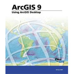
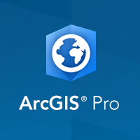
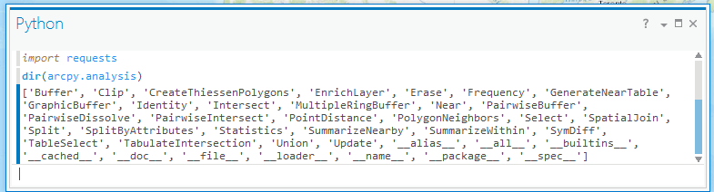
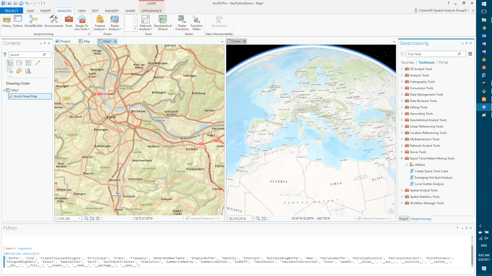
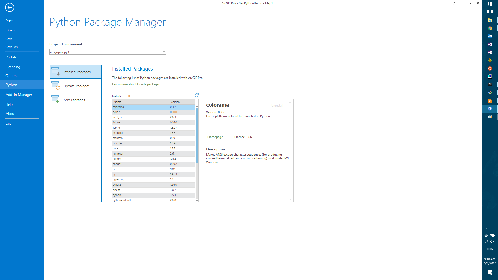
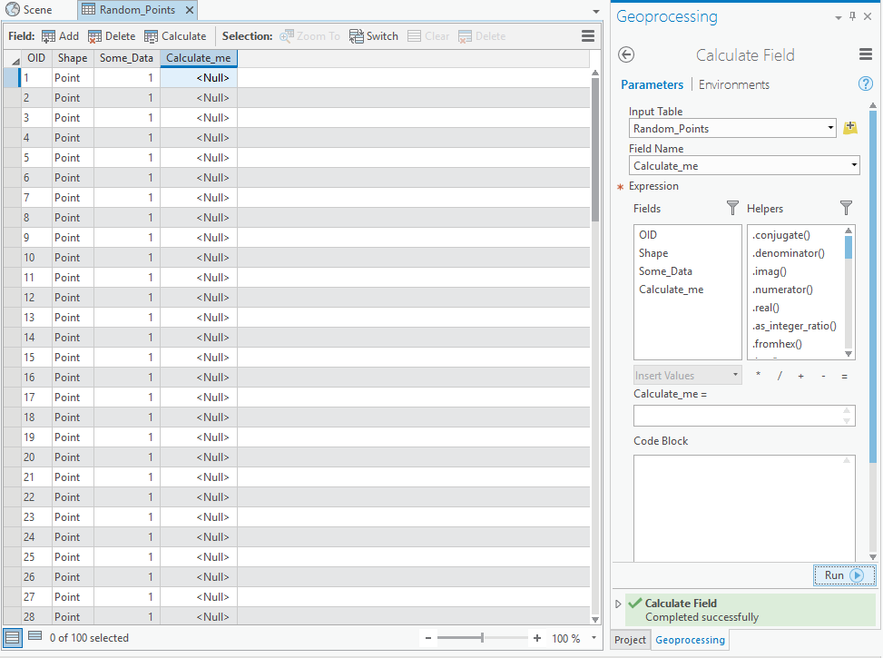
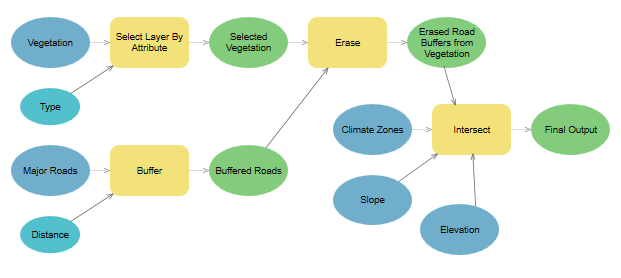

<section data-background="../docs/images/title.png">
<h1>Professional Python Development in ArcGIS Pro</h1>
 
<h2>Clinton Dow</h2>
</section>

[High Quality PDF (2MB)](https://data-navigator.github.io/professional-python-in-pro-geopython-2017/geopython-2017-pro-presentation-handout.pdf) {data-background="../docs/images/Picture2.jpg"}
------------------------

Introduction {data-background="../docs/images/Picture2.jpg"}
============================================================

Today's Presentation {data-background="../docs/images/Picture2.jpg"}
--------------------------------------------------------------------

Overview of ArcGIS Pro

 - Work accomplished in the past year
 - Tour of Documentation and Code samples
 - Esri's open source participation and integration
 - Explanation of Tool creation concepts

Product Engineer - Geoprocessing at Esri California (1 year 8 months) {data-background="../docs/images/Picture2.jpg"}
---------------------------------------------------------------------------------------------------------------------
 

 - Python

  - ArcPy
  - Conda Integration

 - C#/WPF

  - Python Backstage
  - Charts and Graphs

 - Presentations

GIS Developer at Matrix Solutions in Calgary (2 years) {data-background="../docs/images/Picture2.jpg"}
------------------------------------------------------------------------------------------------------

 - Civil Engineering/Environmental Consultant Firm
 - Created several dozen custom Geoprocessing tools in Python
 - Customized ArcGIS with Python and C#/WPF

Esri ArcGIS {class="tight"} {data-background="../docs/images/Picture2.jpg"}
============================================================

Setting up ArcGIS Pro {data-background="../docs/images/Picture2.jpg"}
---------------------------------------------------------------------

**Windows Only**

Free Windows VMs
 - [http://bit.ly/FreeWindowsVM](http://bit.ly/FreeWindowsVM)

Free ArcGIS Pro
 - [(http://bit.ly/ArcPyProTrial](http://bit.ly/ArcPyProTrial)

ArcPy Documentation
 - [http://bit.ly/ArcPyDocs](http://bit.ly/ArcPyDocs)

Why ArcGIS? - Powerful and Proven technology {data-background="../docs/images/Picture2.jpg"}
--------------------------------------------------------------------------------------------

ARC/INFO released in 1982

ArcGIS in 1999

Why ArcGIS? - Powerful and Proven technology {data-background="../docs/images/Picture2.jpg"}
--------------------------------------------------------------------------------------------
 
ArcGIS Pro in 2015

 
 

Extensive Python Support:

   - [ArcPy](http://pro.arcgis.com/en/pro-app/arcpy/get-started/what-is-arcpy-.htm)

   - [ArcGIS Python API](https://developers.arcgis.com/python/)

 
Integrated Python Interpreter

Why ArcGIS? - Documentation {data-background="../docs/images/Picture2.jpg"}
---------------------------------------------------------------------------

Second-to-None Documentation

Esri Blog
 - [https://blogs.esri.com/esri/arcgis/category/subject-python/](https://blogs.esri.com/esri/arcgis/category/subject-python/)

Esri Press
 - [http://esripress.esri.com/display/index.cfm](http://esripress.esri.com/display/index.cfm)

ArcGIS Help
 - [https://pro.arcgis.com/en/pro-app/help/main/welcome-to-the-arcgis-pro-app-help.htm](https://pro.arcgis.com/en/pro-app/help/main/welcome-to-the-arcgis-pro-app-help.htm)

GeoNet
- [https://geonet.esri.com](https://geonet.esri.com)

 - Esri Forums/Social Network
 - Python Community
 - [https://geonet.esri.com/community/developers/gis-developers/python](https://geonet.esri.com/community/developers/gis-developers/python)

Why ArcGIS? - Versatility {data-background="../docs/images/Picture2.jpg"}
-------------------------------------------------------------------------

Supports multiple GIS Applications

   - ArcGIS Desktop (Includes ArcGIS Pro)
   - ArcGIS Enterprise
   - ArcGIS Online

Includes over 1000 Geoprocessing Tools

   - From simple (Buffer, Spatial Join)
   - To Complex (Space-Time Cube, Generate Tessellation)

Advanced Projection Engine

   - Supports dozens of projections/transformations

Why ArcGIS? - Geospatial Data {data-background="../docs/images/Picture2.jpg"}
-----------------------------------------------------------------------------

Rich source of GIS Data

   - ArcGIS Online provides thousands of ready-to-go data sets.
     - Living Atlas of The World
     - ArcGIS Online

Large selection of Plugins

   - [https://marketplace.arcgis.com/](https://marketplace.arcgis.com/)

Why ArcGIS? - Industry Standard {data-background="../docs/images/Picture2.jpg"}
-------------------------------------------------------------------------------

Included suite of cartographic symbology.

Industry Standard solution

   - Used by Governments, Fortune 500 companies and Individuals.
     - Swiss Gov't examples (Canton Governments, Swiss Institute of Forest, Snow and Landscape Research etc)

{style="width: 400px; height: 200px; background-color: rgba(255, 255, 255, 1);"}

Why ArcGIS Pro? {data-background="../docs/images/Picture2.jpg"}
---------------------------------------------------------------

Modern View for ArcGIS:

 - .Net 4.5 concurrency model
 - Integrated 2D and 3D views
 - In active development, New Features
 - Modern Python Experience
   - Supports environments and packages via Conda

ArcGIS Pro {data-background="../docs/images/Picture2.jpg"}
---------------------------------------------------------------

{style="width: 1000px; height=780px; background-color: rgba(255, 255, 255, 1);"}

Python Packages and Environments {data-background="../docs/images/Picture2.jpg"}
================================

Package Management on Windows{data-background="../docs/images/Picture2.jpg"}
----------------------------------------------------------------------------

Using pip, wheels, virtualenvs

 - Packaged with distributions of Python
 - These tools handle the harder problem of system dependencies, considered out of scope by Python packagers --- does it end up in site-packages?
 - Package devs: On OSX and Linux, 'easy' to get the deps! Use a system package manager (e.g. apt, brew, yum)
 - Included Compiler (e.g. clang, gcc).

Virtual Environments {data-background="../docs/images/Picture2.jpg"}
--------------------------------------------------------------------

What are Virtual Environments

 - Self-contained instances of Python
 - Seperate from main Python installation
 - Can contain a unique set of packages
 - Useful when working on multiple projects at one time

What about Windows? {data-background="../docs/images/Picture2.jpg"}
-------------------------------------------------------------------

Windows lacks broadly used package management

 - Only developers have a C compiler on their machine (Typically Visual Studio)
 - A hard problem for many organizations to reliably solve
   - "Works on my machine but not yours" problem.
   - Supporting users takes up valuable dev time
   - No guarantee that customers will be supported

Enter Conda {data-background="../docs/images/Picture2.jpg"}
===========
{style="width: 400px; height: 200px; background-color: rgba(255, 255, 255, 1);"}
{style="width: 400px; height: 200px; background-color: rgba(255, 255, 255, 1);"}

Why Conda? {data-background="../docs/images/Picture2.jpg"}
----------------------------------------------------------

Scientific Python community identified that there was a gap not being addressed by the core Python infrastructure, limiting their ability to get packages into the hands of users

Industry standard built by people who care about this space &mdash; Continuum Analytics

Handles dependencies for many languages (C, C++, R and of course Python)

Built for Python first, but it really solves a much broader infrastructural issue.

Conda in ArcGIS Pro {data-background="../docs/images/Picture2.jpg"}
-------------------------------------------------------------------

Significant effort has been made at Esri to integrate the conda package
manager and virtual environment experience into the ArcGIS Pro
experience.

 - Shipped with environment support
 - In-app user interface
 - Packaging effort for Esri Python code

Conda in ArcGIS Pro {data-background="../docs/images/Picture2.jpg"}
-------------------------------------------------------------------

{style="width: 1000px; height=780px; background-color: rgba(255, 255, 255, 1);"}

Coming Soon {data-background="../docs/images/Picture2.jpg"}
-----------------------------------------------------------

Support for custom channels

 - Public Channels
 - Private Channels

 
Package Creation via UI

 - Currently only available in cmd line
 - Share packages with colleagues and customers

 
Additional Support on Server

 - Conda packages and environments fully supported on Enterprise
 - ArcGIS Python API Notebooks served on Enterprise

Using Packages to our Advantage {data-background="../docs/images/Picture2.jpg"}
===============================================================================

Open Source Ecosystem {data-background="../docs/images/Picture5.jpg"}
----------------------------------------------------------------------------------------------------------------

The Python Ecosystem includes thousands of open-source packages

Esri is using several packages in ArcGIS

   - NumPy
   - SciPy
   - matplotlib
   - Pandas (coming soon)

Open Source Ecosystem {data-background="../docs/images/Picture5.jpg"}
----------------------------------------------------------------------------------------------------------------

Automate or Extend your ArcGIS capabilities

   - [Thousands of open-souce Python packages](https://repo.continuum.io/pkgs/)
   - [Conda-Forge community](https://conda-forge.github.io/feedstocks)

Easily package and share your work

   - [Conda-build](https://github.com/conda/conda-build)
   - [Anaconda.org](https://anaconda.org/esri)
   - Host packages on network

Setting up a Development Environment {data-background="../docs/images/Picture2.jpg"}
------------------------------------

What can we install?  Not just scientific packages.

   - Documentation
   - Datasets
   - GUI toolkits (PyQt, TKinter)
   - Database Drivers (psycopg2)
   - C++ Libraries (Boost)
   - IDEs
     - [Spyder](https://github.com/spyder-ide/spyder#overview)
     - [Juptyer](https://jupyter.org/)

Setting up a Production Environment {data-background="../docs/images/Picture2.jpg"}
-----------------------------------------------------------------------------------

Proven environments that will 'Just work'

   - Solves 'works on my machine' problem
   - Metapackages
    - Packages which only have requirements
   - [Environment.yaml](https://conda.io/docs/using/envs.html#id12)
    - More complex requirements.txt

Working with Customers {data-background="../docs/images/Picture2.jpg"}
======================

Requirements Analysis {data-background="../docs/images/Picture2.jpg"}
---------------------------------------------------------------------

Determining user expectations for a new or modified product

 - Identify Stakeholders

 - Eliciting Requirements
   - Stakeholder interviews

 - Analyzing Requirements
   - Clear
   - Complete
   - Consistent

 - Recording Requirements
   - User Stories
   - Use Cases

Test Driven Development {data-background="../docs/images/Picture2.jpg"}
-----------------------------------------------------------------------

Turning valid requirements into testable code

 - Identifying units of work
  - Preexisting tools?
 - Defining functional extent of units
 - Writing tests to encapsulate functionality

TDD in Python {data-background="../docs/images/Picture2.jpg"}
-------------------------------------------------------------

Several test suites available

 - [Pytest](https://docs.pytest.org/en/latest/)
 - [Nose](http://nose.readthedocs.io/en/latest/)
 - [unittest](https://docs.python.org/3/library/unittest.html)

Efficient Testing with ArcPy {data-background="../docs/images/Picture2.jpg"}
----------------------------------------------------------------------------

Extra considerations for Geospatial tools

- Data set types
  - Feature Class (Geodatabase)
  - Shapefiles (Esri Open-Source Format)
  - GeoJSON (Generic Open-Source Format)

- Projections
  - Data Frame (View)
  - Data Sets

- UI interactions
  - Data Validation

Version Control as a Communication Tool {data-background="../docs/images/Picture2.jpg"}
=======================================

What is Git? {data-background="../docs/images/Picture2.jpg"}
------------------------------------------------------------

[Git](https://git-scm.com/)

A distributed version control system.

 - Originally made for linux developers
 - Arguably the most popular open-source version control
 - Heavily used in Conda packaging workflow

Why Git? {data-background="../docs/images/Picture2.jpg"}
--------------------------------------------------------

Features of Git that support Conda packaging

 - Commit hash as version number
   - Excellent for testing development versions
 - Packages can 'cherry-pick' parts of repositories
   - Production packages may not include tests etc.
 - Develop with a team
   - Intuitive branching and merging

What is Github {data-background="../docs/images/Picture2.jpg"}
--------------------------------------------------------------

[Github](https://github.com)

Github promotes 'Social Coding' a combination of Version Control and
Social Media

 - Ease of Collaboration
 - Ease of Communication
 - Ease of Distribution

Esri on Github

 - https://www.github.com/Esri
 - https://www.github.com/arcpy

Github as a Communication Tool {data-background="../docs/images/Picture2.jpg"}
------------------------------------------------------------------------------

Github offers several features which enhance communication
 - [Issue tracking](https://github.com/Esri/esri-leaflet/issues)
 - Tags
 - User Notifications
 - Repository Forking
   - Create your own version of code

Beginner Python - Python Features in ArcGIS Pro UI {data-background="../docs/images/Picture2.jpg"}
==================================================================================================

Python Window {data-background="../docs/images/Picture2.jpg"}
-------------------------------------------------------------

Quick means of interacting with ArcGIS Pro using Python

 - Good way to practice and test concepts
 - View help documentation for ArcPy functions
 - Import and Export Python Scripts

Interactive Selections

 - Operate on data selected on Map
 - Automatically show result in Map

Field Calculator {data-background="../docs/images/Picture2.jpg"}
----------------------------------------------------------------

Leverage the power of Python to enhance your data sets

 - [Utilize Python to calculate new fields](http://pro.arcgis.com/en/pro-app/help/data/tables/fundamentals-of-field-calculations.htm)
 - Available through Pro UI
 - Extract code to Scripts
   - [Data access ArcPy module](https://pro.arcgis.com/en/pro-app/arcpy/data-access/what-is-the-data-access-module-.htm)
   - Calculate fields using Cursors without UI interaction

{style="width: 500px; height=480px; background-color: rgba(255, 255, 255, 1);"}

Intermediate Python - Creating Tools in ArcGIS Pro {data-background="../docs/images/Picture2.jpg"}
==================================================================================================

TBX Toolboxes {data-background="../docs/images/Picture2.jpg"}
-------------------------------------------------------------

[The original ArcGIS toolbox.](https://geonet.esri.com/blogs/dan_patterson/2016/05/19/toolbox-creation-in-arcgis-pro)
 - Created via the ArcGIS GUI
 - Tool Validation not set in Python script
   - Set via 'Properties' menu of tool in ArcGIS

Python Toolboxes {data-background="../docs/images/Picture2.jpg"}
----------------------------------------------------------------

[ArcGIS toolboxes revisited in Python](http://pro.arcgis.com/en/pro-app/arcpy/geoprocessing_and_python/a-quick-tour-of-python-toolboxes.htm)
 - All steps defined in a .pyt file
  - Ease of testing & debugging
 - Validation defined within script
 - Works with Python IDEs
   - Define .pyt as a Python file type in settings
     - Syntax Highlighting
     - Autocomplete

Python Toolboxes {data-background="../docs/images/Picture2.jpg"}
----------------------------------------------------------------

[Python Toolbox (.pyt) Files](http://pro.arcgis.com/en/pro-app/arcpy/geoprocessing_and_python/a-template-for-python-toolboxes.htm)
 - Toolbox Class
   - __init__
   - self.tools
 - Tool Class
   - __init__
   - Validation
   - Logic

Tool Validation {data-background="../docs/images/Picture2.jpg"}
---------------------------------------------------------------

ArcGIS Supports Dozens of Data Types
 - Ensure the inputs supplied by the user are valid
 - Dynamically populate fields with values
 - Inform users when unexpected or unusable data is present

Input/Output Parameters {data-background="../docs/images/Picture2.jpg"}
-----------------------------------------------------------------------

Defining Parameters
Working with Input Parameters
 - GetInputParameter
 - GetInputParameterAsText
 - Parameters from Command Line
Working with Output Parameters
 - Schema
   - ParameterDependencies

getParameterInfo {data-background="../docs/images/Picture2.jpg"}
----------------------------------------------------------------

Populate the values of a Tool's Parameters
 - Called when the tool is opened.
 - Populate input parameters with inital values

updateParameters {data-background="../docs/images/Picture2.jpg"}
----------------------------------------------------------------

Refine and Modify the values of a Tool's Parameters
 - Called whenever a parameter has been changed in the ArcGIS GUI
 - Frequent calls
   - Make method 'inexpensive' if possible
   - May use 'global' values to store results after first call

updateMessages {data-background="../docs/images/Picture2.jpg"}
--------------------------------------------------------------

Modify the Messages created when a Tool's Parameters have changed
 - Called after validation has been performed.
 - Display a Warning or Error to users if Parameters have bad values

isLicensed {data-background="../docs/images/Picture2.jpg"}
----------------------------------------------------------

Query the license system to ensure the tool can run at the current
license level.
 - Checking for licenses

execute {data-background="../docs/images/Picture2.jpg"}
-------------------------------------------------------

The tool's source code which is run upon tool execution.
 - Error Handling
   - AddMessage
   - AddWarning
   - AddError

Where the Geoprocessing of data is accomplished
 - Set output dataset to allow for chaining in ModelBuilder
   - SetOutputParameter

Model Builder {data-background="../docs/images/Picture2.jpg"}
-------------------------------------------------------------

[Model Builder](http://pro.arcgis.com/en/pro-app/help/analysis/geoprocessing/modelbuilder/what-is-modelbuilder-.htm)

Allows for visual creation of Geoprocessing tools

 - Consume custom geoprocessing tools
   - Ensure you are setting an output!
 - Export to Python code
 - A good way to introduce scripting concepts

Advanced Python - Modular Design and Packages {data-background="../docs/images/Picture2.jpg"}
=============================================================================================

Validation modules {data-background="../docs/images/Picture2.jpg"}
------------------------------------------------------------------

For each validation requirement:

 - Create a function which will validate a dataset
 - Create a dataset which satisfies the validation requirements
 - Create one or more datasets which do not satisfy requirements
 - Write validation functions

Debugging/Testing Tool Validation {data-background="../docs/images/Picture2.jpg"}
---------------------------------------------------------------------------------

Creating tests for validation:

 - Validation accomplishes two things
   - Ensuring the data set is 'clean'
   - Ensuring the data set will not crash the tool
 - Two types of tests
   - Correct data does not trigger any errors
   - Incorrect data is error handled and returns a message

Planning the Logic of a Tool {data-background="../docs/images/Picture2.jpg"}
----------------------------------------------------------------------------

For each requirement in a tool:

 - Create a function which accomplishes the requirement statement
 - Call the function from the applicable test method(s)
 - Commit when the code passes the test(s)

Granularity in Tool Design {data-background="../docs/images/Picture2.jpg"}
--------------------------------------------------------------------------

Can we break a tool into multiple tools?

 - Does any requirement make sense as a standalone tool?
 - Can we chain the tools together based off input/output parameters?
 - Can these sub-tools be made more robust?
  - Handle more data types
  - Improve processing speed

Reusing Modular Code {data-background="../docs/images/Picture2.jpg"}
--------------------------------------------------------------------

Tool Metadata

 - Tags
 - Documentation

Conda Environments {data-background="../docs/images/Picture2.jpg"}
==================

Development Environments {data-background="../docs/images/Picture2.jpg"}
------------------------------------------------------------------------

Contains features in development

  - May use alpha/beta code
  - Contain test modules & data
  - Mirrored by version control

Production Environments {data-background="../docs/images/Picture2.jpg"}
-----------------------------------------------------------------------

Stable environments in which to run tools/services

 - Ship reference to env with Project, Tool etc
 - Requires stable versions of packages

Packaging Tools the Right Way {data-background="../docs/images/Picture2.jpg"}
=============================

Creating a Package {data-background="../docs/images/Picture2.jpg"}
------------------------------------------------------------------

Using setuptools and distutils to create a Python Package.

 - setuptools
   - setup
   - pkg_resources
 - distutils
   - Legacy, use setuptools if possible

Creating a conda package

  - bld.bat/bld.sh
  - LICENSE
  - Manifest.in
  - meta.yaml
  - README.md
  - setup.py

Deploying a Package Internally {data-background="../docs/images/Picture2.jpg"}
------------------------------------------------------------------------------

On a network
 - Point at a network location containing a package
Via a http server
 - All advantages of any http service
   - Authentication
   - Metrics
   - Availability

Deploying a Package Publicly {data-background="../docs/images/Picture2.jpg"}
----------------------------------------------------------------------------

Python Package Index
Anaconda.org
Custom Server

Viewing the Tool Output {data-background="../docs/images/Picture2.jpg"}
=======================

Tools in ArcGIS Pro {data-background="../docs/images/Picture2.jpg"}
-------------------------------------------------------------------

Demonstration

 - Geoprocessing History
  - Stack-trace when tool fails
 - Result File

Deploying a Tool as a Service {data-background="../docs/images/Picture2.jpg"}
-----------------------------------------------------------------------------

Tools and data sets can be uploaded to ArcGIS Enterprise or ArcGIS
Online as services.

Demonstration

Consuming services via the ArcGIS Python API {data-background="../docs/images/Picture2.jpg"}
--------------------------------------------------------------------------------------------

The ArcGIS Python API is a cross-platform solution which allows for
users to view, administer and interact with services on ArcGIS
Enterprise or ArcGIS Online.

 - More info to come tomorrow!

Thank you!! Questions/Comments?? cdow@esri.com
==============================================

