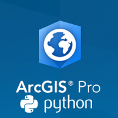

% Professional Python Development in ArcGIS Pro
% Clinton Dow

<section data-background="images/title.png">
<h2>[https://github.com/scw/conda-uc-2017-demo](https://github
.com/scw/conda-uc-2017-demo)</h2>
<h3>[High Quality PDF (2MB)](https://4326
.us/esri/conda-uc/uc-2017-conda-arcgis-demo-full.pdf)</h3>
</section>

Introduction {data-background="images/Picture2.jpg"}
====================================================

Intro
-------------------------------------------------

About me:
 - Product Engineer - Geoprocessing at Esri (1 year 8 months)
    - Python
      - ArcPy
      - Conda Integration
    - C#/WPF
      - Python Backstage
      - Charts and Graphs
    - Presentations
 - Previously a GIS Developer at Matrix Solutions in Calgary
   - Civil Engineering/Environmental Consultant Firm
   - Created several dozen custom Geoprocessing tools in Python
   - Customized ArcGIS with Python and C#/WPF

Esri ArcGIS
===========
{class="tight"} {data-background="images/Picture2.jpg"}

Setting up ArcGIS Pro
---------------------
 - **Windows Only**
 - Free Windows VMs
   - (http://bit.ly/FreeWindowsVM)
 - Free ArcGIS Pro
   - (http://bit.ly/ArcPyProTrial)
 - ArcPy Documentation
   - http://bit.ly/ArcPyDocs

Why ArcGIS? {class="tight"} {data-background="images/Picture2.jpg"}
-----------------------------------------------------------------------------------------------------

 - Powerful and Proven technology
    - ARC/INFO released in 1982
    - ArcGIS in 1999
    - ArcGIS Pro in 2015
 - Extensive Python Support:
   - [ArcPy](http://pro.arcgis.com/en/pro-app/arcpy/get-started/what-is-arcpy-.htm)
   - [ArcGIS Python API](https://developers.arcgis.com/python/)
 - Second-to-None Documentation
   - Esri Blog
   - Esri Press
   - ArcGIS Help
 - Supports multiple GIS Applications
   - ArcGIS Desktop
   - ArcGIS Enterprise
   - ArcGIS Online
 - Rich source of GIS Data
   - ArcGIS Online provides thousands of ready-to-go datasets.
 - Large selection of Plugins
   - https://marketplace.arcgis.com/
 - Included suite of cartographic symbology.
 - Industry Standard solution - Used by Governments, Fortune 500 companies and Individuals.
    - Swiss Gov't examples (Canton Governments, Swiss Institute of Forest, Snow and Landscape Research etc)

Why ArcGIS Pro? {data-background="images/Picture2.jpg"}
---------------------------------------------------------------------------------------------------------

Modern View for ArcGIS:

 - .Net 4.5 concurrency model
 - Integrated 2D and 3D views
 - In active development, New Features
 - Modern Python Experience
   - Supports environments and packages via Conda

{style="width: 200px; background-color: rgba(255, 255, 255, 1);"}

Python Packages and Environments
================================

Package Management on Windows{data-background="images/Picture2.jpg"}
--------------------------------------------------------------------
Using ``pip``, wheels, virtualenvs
 - Packaged with distributions of Python
 - These tools handle the harder problem of system dependencies, considered out of scope by Python packagers --- does it end up in ``site-packages``?
 - Package devs: On OSX and Linux, 'easy' to get the deps! Use a system package manager (e.g. ``apt``, ``brew``, ``yum``) and the included compiler (e.g. ``clang``, ``gcc``).

Virtual Environments
--------------------
What are Virtual Environments
 - Self-contained instances of Python
 - Seperate from main Python installation
 - Can contain a unique set of packages
 - Useful when working on multiple projects at one time

What about Windows? {data-background="images/Picture2.jpg"}
-------------------
 * We are particularly stuck on Windows which lacks broadly used package management 
 * Only developers have a C compiler on their machine (Typically Visual Studio)
 * A hard problem for many organizations to reliably solve
   - "Works on my machine but not yours" problem.
   - Supporting users takes up valuable dev time
   - No guarantee that customers will be supported

Enter Conda
===========
{style="width: 200px; background-color: rgba(255, 255, 255, 1);"}
{style="width: 200px; background-color: rgba(255, 255, 255, 1);"}

Why Conda? {data-background="images/Picture2.jpg"}
----------
 - Scientific Python community identified that there was a gap not being addressed by the core Python infrastructure, limiting their ability to get packages into the hands of users
 - Industry standard built by people who care about this space &mdash; Continuum Analytics
 - Handles dependencies for many languages (C, C++, R and of course Python)
 - Built for Python first, but it really solves a much broader infrastructural issue.

Conda in ArcGIS Pro
-------------------
Significant effort has been made at Esri to integrate the conda package
manager and virtual environment experience into the ArcGIS Pro
experience.
 - Shipped with environment support
 - In-app user interface
 - Packaging effort for Esri Python code

Using Packages to our Advantage {data-background="images/Picture5.jpg"}
=======================================================================

Open Source Ecosystem {class="tight"} {data-background="images/Picture5.jpg"}
----------------------------------------------------------------------------------------------------------------

 - The Python Ecosystem includes thousands of open-source packages
 - Esri is using several packages
   - NumPy
   - SciPy
   - matplotlib
   - Pandas
 - Automate or Extend your ArcGIS capabilities
 - Easily package and share your work

Setting up a Development Environment
------------------------------------

 - What can we install?  Not just scientific packages.
   - Documentation
   - Datasets
   - GUI toolkits (PyQt, TKinter)
   - Database Drivers (psycopg2)
   - C++ Libraries (Boost)
   - IDEs (Spyder, Juptyer)

Working with Customers
======================

Requirements Analysis
---------------------
Determining user expectations for a new or modified product
 - Identify Stakeholders
 - Eliciting Requirements
   - Stakeholder interviews
   - Ethnography
 - Analyzing Requirements
   - Clear
   - Complete
   - Consistent
 - Recording Requirements
   - User Stories
   - Use Cases

Test Driven Development
-----------------------
Turning valid requirements into testable code
 - Identifying units of work
 - Defining functional extent of units
 - Writing tests to encapsulate functionality

Efficient Testing with ArcPy
----------------------------
Extra considerations for Geospatial tools
 - Data set types
 - Projections
 - UI interactions

Version Control as a Communication Tool
=======================================

What is Git?
------------
A distributed version control system.
 - Originally made for linux developers
 - Arguably the most popular open-source version control
 - Heavily used in Conda packaging workflow

Why Git?
--------
Features of Git that support Conda packaging
 - Commit hash as version number
 - Natively supports cross-language projects
 - Packages can 'cherry-pick' parts of repos
 - Also can aggregate multiple repos

What is Github
--------------
Github promotes 'Social Coding' a combination of Version Control and
Social Media
 - Ease of Collaboration
 - Ease of Communication
 - Ease of Distribution
Esri on Github
 - https://www.github.com/Esri
 - https://www.github.com/arcpy

Github as a Communication Tool
------------------------------
Github offers several features which enhance communication
 - Issue tracking
 - Tags
 - User Notifications
 - Repository Forking

Creating Tools in ArcGIS Pro
============================

TBX Toolboxes
-------------
The original ArcGIS toolbox.
 - Created via the ArcGIS GUI
 - Tool Validation not set in Python script
   - Set via 'Properties' menu of tool in ArcGIS
 - Out of scope for this Presentation

Python Toolboxes
----------------
ArcGIS toolboxes revisited in Python
 - All steps defined in a .pyt file
 - Validation defined within script
 - Works with Python IDEs
   - Define .pyt as a Python filetype in settings
 - Toolbox Class
   - __init__
   - self.tools
 - Tool Class
   - __init__
   - Validation
   - Logic

Tool Validation
---------------
ArcGIS Supports Dozens of Data Types
 - Ensure the inputs supplied by the user are valid
 - Dynamically populate fields with values
 - Inform users when unexpected or unusable data is present

Input/Output Parameters
-----------------------
Defining Parameters
Working with Input Parameters
 - GetInputParameter
 - GetInputParameterAsText
 - Parameters from Command Line
Working with Output Parameters
 - Schema
   - ParameterDependencies

getParameterInfo
--------------------
Populate the values of a Tool's Parameters
 - Called when the tool is opened.
 - Populate input parameters with inital values

updateParameters
----------------
Refine and Modify the values of a Tool's Parameters
 - Called whenever a parameter has been changed in the ArcGIS GUI
 - Frequent calls
   - Make method 'inexpensive' if possible
   - May use 'global' values to store results after first call

updateMessages
--------------
Modify the Messages created when a Tool's Parameters have changed
 - Called after validation has been performed.
 - Display a Warning or Error to users if Parameters have bad values

isLicensed
----------
Query the license system to ensure the tool can run at the current
license level.
 - Checking for licenses

execute
-------
The tool's source code which is run upon tool execution.
 -

Tool Logic
----------
Where the Geoprocessing of data is accomplished
 - This is the only part of the code which should call Geoprocessing Tools
 - Returns either a dataset or a status code
   - SetSeverityLevel
   - SetOutputParameter

Modular Design
==============

Validation modules
------------------
For each validation requirement:
 - Create a function which will validate a dataset
 - Create a dataset which satisfies the validation requirements
 - Create one or more datasets which do not satisfy requirements
 - Write validation functions

Debugging/Testing Tool Validation
---------------------------------
Creating tests for validation:
 - Validation accomplishes two things
   - Ensuring the data set is 'clean'
   - Ensuring the data set will not crash the tool
 - Two types of tests
   - Correct data does not trigger any errors
   - Incorrect data is error handled and returns a message

Planning the Logic of a Tool
----------------------------
For each requirement in a tool:
 - Create a function which accomplishes the requirement statement
 - Call the function from the applicable test method(s)
 - Commit when the code passes the test(s)

Granularity in Tool Design
--------------------------
Can we break a tool into multiple tools?
 - Does any requirement make sense as a standalone tool?
 -

Reusing Modular Code
--------------------
Tool Metadata
 - Tags

Conda Environments
==================

Development Environments
------------------------
- Contains features in development
  - May use alpha/beta code
  - Contain test modules & data
  - Mirrored by version control
- Contains packaging metadata
  - bld.bat/bld.sh
  - LICENSE
  - Manifest.in
  - meta.yaml
  - README.md
  - setup.py

Production Environments
-----------------------
- Stable environments in which to run tools/services
  - Requires stable versions of packages
  -

Packaging Tools the Right Way
=============================

Creating a Package
------------------
Using setuptools and distutils to create a Python Package.
 - setuptools
   - setup
   - pkg_resources
 - distutils
   - Legacy, use setuptools if possible
Creating a conda package
 - conda-build
   - meta.yaml

Documenting a Package
---------------------

Deploying a Package Internally
------------------------------
On a network
Via a http server

Deploying a Package Publicly
----------------------------
Python Package Index
Anaconda.org
Custom Server

Viewing the Tool Output
=======================

Tools in ArcGIS Pro
-------------------

Deploying a Tool as a Service
-----------------------------

Consuming services via the ArcGIS Python API
--------------------------------------------